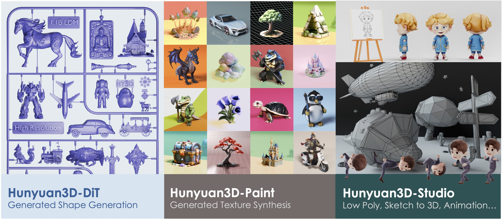

hello

<p align="center"> 
  

</p>

<div align="center">
  <a href=https://3d.hunyuan.tencent.com target="_blank"></a>
  <a href=https://huggingface.co/spaces/tencent/Hunyuan3D-2  target="_blank"></a>
  <a href=https://huggingface.co/tencent/Hunyuan3D-2 target="_blank"></a>
  <a href=https://3d-models.hunyuan.tencent.com/ target="_blank"></a>
  <a href=https://discord.gg/dNBrdrGGMa target="_blank"></a>
  <a href=https://arxiv.org/abs/2501.12202 target="_blank"></a>
  <a href=https://x.com/txhunyuan target="_blank"></a>
 <a href="#community-resources" target="_blank"></a>
</div>

[//]: # (  <a href=# target="_blank"></a>)

[//]: # (  <a href=# target="_blank"></a>)

[//]: # (  <a href="#"></a>)

<br>


---


<p align="center">
  
</p>


<p align="left">
  
</p>


```


```


### Official Site

Don't forget to visit [Hunyuan3D](https://3d.hunyuan.tencent.com) for quick use, if you don't want to host yourself.

## 📑 Open-Source Plan

- [x] Inference Code
- [x] Model Checkpoints
- [x] Technical Report
- [ ] ComfyUI
- [ ] TensorRT Version

## 🔗 BibTeX

If you found this repository helpful, please cite our reports:

```bibtex
@misc{hunyuan3d22025tencent,
    title={Hunyuan3D 2.0: Scaling Diffusion Models for High Resolution Textured 3D Assets Generation},
    author={Tencent Hunyuan3D Team},
    year={2025},
    eprint={2501.12202},
    archivePrefix={arXiv},
    primaryClass={cs.CV}
}

@misc{yang2024hunyuan3d,
    title={Hunyuan3D 1.0: A Unified Framework for Text-to-3D and Image-to-3D Generation},
    author={Tencent Hunyuan3D Team},
    year={2024},
    eprint={2411.02293},
    archivePrefix={arXiv},
    primaryClass={cs.CV}
}
```

## Community Resources

Thanks for the contributions of community members, here we have these great extensions of Hunyuan3D 2.0:

- [ComfyUI-3D-Pack](https://github.com/MrForExample/ComfyUI-3D-Pack)
- [ComfyUI-Hunyuan3DWrapper](https://github.com/kijai/ComfyUI-Hunyuan3DWrapper)
- [Hunyuan3D-2-for-windows](https://github.com/sdbds/Hunyuan3D-2-for-windows)
- [📦 A bundle for running on Windows | 整合包](https://github.com/YanWenKun/Hunyuan3D-2-WinPortable)
- [Hunyuan3D-2GP](https://github.com/deepbeepmeep/Hunyuan3D-2GP)
- [Kaggle Notebook](https://github.com/darkon12/Hunyuan3D-2GP_Kaggle)

## Acknowledgements

We would like to thank the contributors to
the [DINOv2](https://github.com/facebookresearch/dinov2), [Stable Diffusion](https://github.com/Stability-AI/stablediffusion), [FLUX](https://github.com/black-forest-labs/flux), [diffusers](https://github.com/huggingface/diffusers), [HuggingFace](https://huggingface.co), [CraftsMan3D](https://github.com/wyysf-98/CraftsMan3D),
and [Michelangelo](https://github.com/NeuralCarver/Michelangelo/tree/main) repositories, for their open research and
exploration.

## Star History

<a href="https://star-history.com/#Tencent/Hunyuan3D-2&Date">
 <picture>
   <source media="(prefers-color-scheme: dark)" srcset="https://api.star-history.com/svg?repos=Tencent/Hunyuan3D-2&type=Date&theme=dark" />
   <source media="(prefers-color-scheme: light)" srcset="https://api.star-history.com/svg?repos=Tencent/Hunyuan3D-2&type=Date" />
   
 </picture>
</a>
