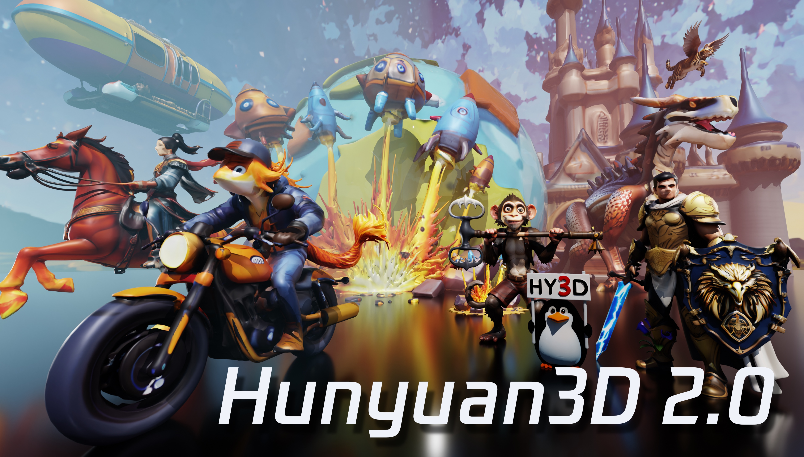

[Read in English](README.md)
[日本語で読む](README_ja_jp.md)

<p align="center">
  

</p>

<div align="center">
  <a href=https://3d.hunyuan.tencent.com target="_blank"></a>
  <a href=https://huggingface.co/spaces/tencent/Hunyuan3D-2  target="_blank"></a>
  <a href=https://huggingface.co/tencent/Hunyuan3D-2 target="_blank"></a>
  <a href=https://3d-models.hunyuan.tencent.com/ target="_blank"></a>
  <a href=https://discord.gg/GuaWYwzKbX target="_blank"></a>
  <a href=https://arxiv.org/abs/2501.12202 target="_blank"></a>
  <a href=https://x.com/txhunyuan target="_blank"></a>
</div>


[//]: # (  <a href=# target="_blank"></a>)

[//]: # (  <a href=# target="_blank"></a>)

[//]: # (  <a href="#"></a>)

<br>

> 新年快乐!


> 加入我们的 **[微信群](#)** and **[Discord 社区](https://discord.gg/GuaWYwzKbX)** 讨论，获取最新进展以及帮助吧.

| Wechat Group                                     | Xiaohongshu                                           | X                                           | Discord                                           |
| ------------------------------------------------ | ----------------------------------------------------- | ------------------------------------------- | ------------------------------------------------- |
|  |  |  |  |

---

<br>
<p align="center">
“通过 3D 创作与编辑让每个人的想象变成现实。”
</p>

## 🔥 最新消息
- Jan 27, 2025: 🛠️ 发布 Blender 插件，欢迎[体验](#blender-addon).
- Jan 23, 2025: 💬 感谢社区成员的 [Windows 安装工具](https://github.com/YanWenKun/Hunyuan3D-2-WinPortable), ComfyUI 支持 [ComfyUI-Hunyuan3DWrapper](https://github.com/kijai/ComfyUI-Hunyuan3DWrapper)， [ComfyUI-3D-Pack](https://github.com/MrForExample/ComfyUI-3D-Pack) 以及其他出色的 [扩展功能](#community-resources).
- Jan 21, 2025: 💬 欢迎来我们的门户网站 [Hunyuan3D Studio](https://3d.hunyuan.tencent.com) 体验更多3D生成功能!
- Jan 21, 2025: 💬 我们开源了 [Hunyuan3D 2.0](https://huggingface.co/tencent/Hunyuan3D-2)的推理代码和预训练权重.
- Jan 21, 2025: 💬 我们发布了 [Hunyuan3D 2.0](https://huggingface.co/spaces/tencent/Hunyuan3D-2). 快来试试吧!

## 概览

混元 3D 2.0 是一款先进的大规模 3D 资产创作系统，它可以用于生成带有高分辨率纹理贴图的高保真度3D模型。该系统包含两个基础组件：一个大规模几何生成模型 — 混元 3D-DiT，以及一个大规模纹理生成模型 — 混元 3D-Paint。
几何生成模型基于流扩散的扩散模型构建，旨在生成与给定条件图像精确匹配的几何模型，为下游应用奠定坚实基础。
纹理生成模型得益于强大的几何和扩散模型先验知识，能够为AI生成的或手工制作的网格模型生成高分辨率且生动逼真的纹理贴图。
此外，我们打造了混元 3D 功能矩阵，一个功能多样、易于使用的创作平台，简化了 3D 模型的制作以及修改过程。它使专业用户和业余爱好者都能高效地对3D模型进行操作，甚至制作动画。
我们对该系统进行了系统评估，结果表明混元 3D 2.0 在几何细节、条件匹配、纹理质量等方面均优于以往的最先进的开源以及闭源模型。 

<p align="center">
  
</p>

## ☯️ **Hunyuan3D 2.0**

### 模型架构

混元 3D 2.0 采用了一个两阶段的生成过程，它首先创建一个无纹理的几何模型，然后为该几何模型合成纹理贴图。这种策略有效地将形状生成和纹理生成的难点分离开来，同时也为生成的几何模型或手工制作的几何模型进行纹理处理提供了灵活性。

<p align="left">
  
</p>

### 性能评估

我们将混元 3D 2.0 与其他开源及闭源的 3D 生成方法进行了评估对比。
数值结果表明，在生成的带纹理 3D 模型的质量以及对给定条件的遵循能力方面，混元 3D 2.0 超越了所有的基准模型。

| Model                   | CMMD(⬇)   | FID_CLIP(⬇) | FID(⬇)      | CLIP-score(⬆) |
| ----------------------- | --------- | ----------- | ----------- | ------------- |
| Top Open-source Model1  | 3.591     | 54.639      | 289.287     | 0.787         |
| Top Close-source Model1 | 3.600     | 55.866      | 305.922     | 0.779         |
| Top Close-source Model2 | 3.368     | 49.744      | 294.628     | 0.806         |
| Top Close-source Model3 | 3.218     | 51.574      | 295.691     | 0.799         |
| Hunyuan3D 2.0           | **3.193** | **49.165**  | **282.429** | **0.809**     |

一些 Hunyuan3D 2.0 的生成结果:
<p align="left">
  
  
</p>

### 预训练模型

| 模型名称               | 发布日期   | 参数 | Huggingface                                                                         |
| ---------------------- | ---------- | ---- | ----------------------------------------------------------------------------------- |
| Hunyuan3D-DiT-v2-0     | 2025-01-21 | 2.6B | [下载](https://huggingface.co/tencent/Hunyuan3D-2)                                  |
| Hunyuan3D-Paint-v2-0   | 2025-01-21 | 1.3B | [下载](https://huggingface.co/tencent/Hunyuan3D-2)                                  |
| Hunyuan3D-Delight-v2-0 | 2025-01-21 | 1.3B | [下载](https://huggingface.co/tencent/Hunyuan3D-2/tree/main/hunyuan3d-delight-v2-0) |

## 🤗快速入门 Hunyuan3D 2.0

你可以按照以下步骤，通过代码或 Gradio 来使用混元 3D 2.0。

- [代码使用](#代码使用方法)
- [Gradio](#gradio-app-使用方法)
- [API服务器](#api-服务器)
- [Blender插件](#blender-插件)
- [官方网站](#官方网站)

### 依赖包安装

请通过官方网站安装 PyTorch。然后通过以下方式安装其他所需的依赖项。

```bash
pip install -r requirements.txt
# for texture
cd hy3dgen/texgen/custom_rasterizer
python3 setup.py install
cd ../../..
cd hy3dgen/texgen/differentiable_renderer
python3 setup.py install
```


### 代码使用方法

我们设计了一个类似于 diffusers 的 API 来使用我们的几何生成模型 — 混元 3D-DiT 和纹理合成模型 — 混元 3D-Paint。
你可以通过以下方式使用 混元 3D-DiT：

```python
from hy3dgen.shapegen import Hunyuan3DDiTFlowMatchingPipeline

pipeline = Hunyuan3DDiTFlowMatchingPipeline.from_pretrained('tencent/Hunyuan3D-2')
mesh = pipeline(image='assets/demo.png')[0]
```

输出的网格是一个 Trimesh 对象，你可以将其保存为 glb/obj（或其他格式）文件。
对于 混元 3D-Paint，请执行以下操作：

```python
from hy3dgen.texgen import Hunyuan3DPaintPipeline
from hy3dgen.shapegen import Hunyuan3DDiTFlowMatchingPipeline

# let's generate a mesh first
pipeline = Hunyuan3DDiTFlowMatchingPipeline.from_pretrained('tencent/Hunyuan3D-2')
mesh = pipeline(image='assets/demo.png')[0]

pipeline = Hunyuan3DPaintPipeline.from_pretrained('tencent/Hunyuan3D-2')
mesh = pipeline(mesh, image='assets/demo.png')
```

请访问 [minimal_demo.py](minimal_demo.py) 以了解更多高级用法，例如 文本转 3D 以及 为手工制作的网格生成纹理。

### Gradio App 使用方法

你也可以通过以下方式在自己的计算机上托管一个Gradio应用程序：

```bash
python3 gradio_app.py
```

### API 服务器

You could launch an API server locally, which you could post web request for Image/Text to 3D, Texturing existing mesh, and e.t.c.

```bash
python api_server.py --host 0.0.0.0 --port 8080
```
A demo post request for image to 3D without texture.
```bash
img_b64_str=$(base64 -i assets/demo.png)
curl -X POST "http://localhost:8080/generate" \
     -H "Content-Type: application/json" \
     -d '{
           "image": "'"$img_b64_str"'",
         }' \
     -o test2.glb
```

### Blender 插件

With an API server launched, you could also directly use Hunyuan3D 2.0 in your blender with our [Blender Addon](blender_addon.py). Please follow our tutorial to install and use.

https://github.com/user-attachments/assets/8230bfb5-32b1-4e48-91f4-a977c54a4f3e


### 官方网站

如果你不想自己托管，别忘了访问[混元 3D](https://3d.hunyuan.tencent.com)进行快速使用。

## 📑 开源计划

- [x] 推理代码
- [x] 模型权重
- [x] 技术报告
- [ ] ComfyUI
- [ ] TensorRT 量化

## 🔗 引用

如果你发现我们的工作有帮助，你可以以下面的方式引用我们的报告：

```bibtex
@misc{hunyuan3d22025tencent,
    title={Hunyuan3D 2.0: Scaling Diffusion Models for High Resolution Textured 3D Assets Generation},
    author={Tencent Hunyuan3D Team},
    year={2025},
    eprint={2501.12202},
    archivePrefix={arXiv},
    primaryClass={cs.CV}
}

@misc{yang2024hunyuan3d,
    title={Hunyuan3D 1.0: A Unified Framework for Text-to-3D and Image-to-3D Generation},
    author={Tencent Hunyuan3D Team},
    year={2024},
    eprint={2411.02293},
    archivePrefix={arXiv},
    primaryClass={cs.CV}
}
```

## 致谢

We would like to thank the contributors to
the [DINOv2](https://github.com/facebookresearch/dinov2), [Stable Diffusion](https://github.com/Stability-AI/stablediffusion), [FLUX](https://github.com/black-forest-labs/flux), [diffusers](https://github.com/huggingface/diffusers), [HuggingFace](https://huggingface.co), [CraftsMan3D](https://github.com/wyysf-98/CraftsMan3D), and [Michelangelo](https://github.com/NeuralCarver/Michelangelo/tree/main) repositories, for their open research and exploration.

## Star 历史

<a href="https://star-history.com/#Tencent/Hunyuan3D-2&Date">
 <picture>
   <source media="(prefers-color-scheme: dark)" srcset="https://api.star-history.com/svg?repos=Tencent/Hunyuan3D-2&type=Date&theme=dark" />
   <source media="(prefers-color-scheme: light)" srcset="https://api.star-history.com/svg?repos=Tencent/Hunyuan3D-2&type=Date" />
   
 </picture>
</a>
